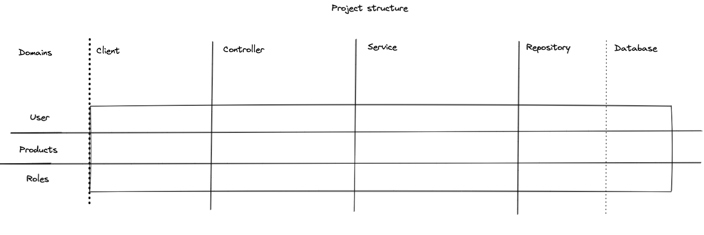
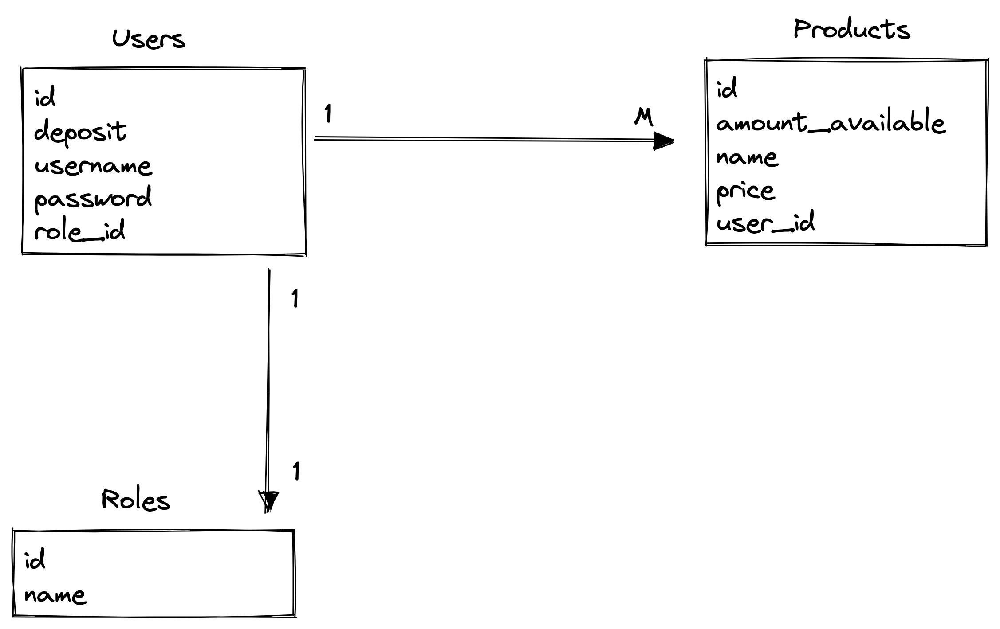

# Vending Machine API

This project contains the REST API for a Vending Machine

# Prerequisites

Tool used for this project:

* Java 11
* Spring Boot
* PostgreSQL
* JUnit
* IntelliJ IDEA
* Gradle

# How to run the project?

After cloning the project, open it in IntelliJ and open the project

* File > Open > vending-machine (folder)
* Open databases and configure PostgreSQL

`host: localhost`

`port: 5432`

`user: postgres`

`password: postgres`

`database: postgres`

After a successful connection to database, you can run the project through IntelliJ.

# Project structure Design

The project structure is formed by Users, Products, Roles which are considered as domains of the
application.

# Database structure Design

Below you find the database relationship between entities: Users, Products, Roles

* `Users 1:M Products`
* `Users 1:1 Roles`

# Regarding testing

I have used MockMVC to test the endpoints. Tests are provided for

* Buy endpoint
* Deposit endpoint
* User CRUD

# How to test the endpoints?

### Swagger

After making a successful run of the project, you may use Swagger API Documentation provided.
To access it, you could open `http://localhost:8080/swagger-ui/#/`

I have provided the Authorization button as well, which could help in the Swagger page to authenticate different users.

### Postman

API could be tested with Postman as well.

# A simple scenario

1. Register a user username `Seller` and role `ROLE_SELLER` (Note* username is unique)
2. Register a user username `Buyer` and role `ROLE_BUYER` (Note* username is unique)
3. Login with user `Seller`
4. Create a new product
5. Login with user `Buyer`
6. Deposit coins in account
7. Buy product

# Final notes

The CRUD for Roles is not implemented